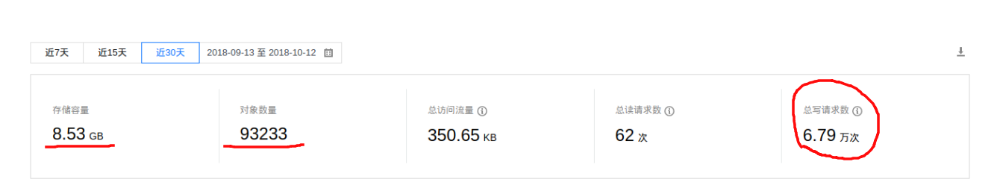

## MM131妹子图片批量下载爬虫py脚本

爬取网站:[MM131](http://mm131.com)

爬了**2000**套妹子图集　将近**10万**张，共**8.5个G**  （图为我的腾讯云cos存储

开始爬取的时候对页面解析得到链接再进行请求，后来发现了站点的url规律

发现对req header伪装一下UA和Referer 就可以直接就可以对图片进行请求,配合上多进程,协程 和线程池进行并发爬取,效率大幅提升!

## Usage:
1.安装依赖:
> pip install -r requirements.txt

2.运行脚本,爬虫有两个版本
* windows建议 运行多线程版本: **thread_mm131.py** 
* linux/os x 运行 多进程+协程版本: **aio_mm131.py** 或前者皆可

